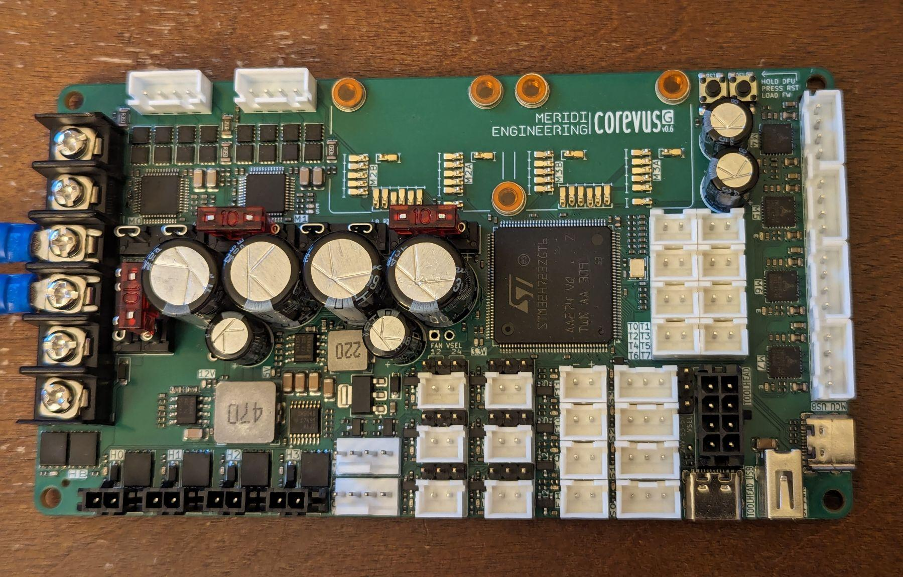

# Corevus-G v0.6 user's manual

This user manual provides information on Corevus-G board revision v0.6 and contains information on hardware features and setting up Klipper.

[table of contents goes here]

## General disclaimer and usage notes

Although v0.6 is much improved over prior Corevus-G prototype revisions, please be aware that this is still not production hardware as I am still gathering data and tracking issues related to long-term reliability. Use at your own risk! That said, if you do experience hardware issues please do inform me and I will try to help track the issue and/or provide replacement hardware if necessary (no guarantees on this though).

Now that we've gotten that out of the way, promise to be careful and not set anything on fire. Thanks

## Hardware overview

- Two integrated >3.0A(rms) TMC2160 drivers with low Rds MOSFETs
- Four integrated 1.2A(rms) TMC2209 drivers.
- Screw-on motor drivers have significantly better current and thermal handling than stepsticks
- 48V on motor drivers supported 
- 4 heaters + DC heatbed output (can drive SSRs or other loads)
- On-board thermistors in key locations (motor drivers, 12V, 5V converters).
- 8 temperature sensor ports (in addition to board thermistors)
- Twelve fan ports, including two 12-volt 4-pin fan ports, six 12/24V jumperable 2-pin fan ports, and four fixed-voltage fan ports
- Four endstop ports, one of which can be configured for 24 volts for inductive probe
- Toolboard breakout allows wiring up a Corevus Toolboard without need for a dedicated breakout board in your electronics bay
  

## Installing Klipper firmware

Flashing can be done over USB-DFU from your Raspberry Pi or other Klipper host computer. Alternatively, you can also build and flash the Klipper firmware on another device such as a desktop computer with Klipper downloaded, which may speed up compilation.

> [!WARNING]
> Installing firmware should be done with Corevus-G disconnected from everything except the flashing device.

Flashing firmware is best done prior to installing Corevus-G in your printer. If you are upgrading firmware on Corevus-G installed in an existing machine, consider taking a picture of the wiring scheme before disconnecting any connected hardware to prevent mistakes when re-wiring.

Connect Corevus-G to your flashing device (e.g. Raspberry Pi) via a USB cable into the 'MCU USB' port. (Don't connect into the 'TOOLHEAD USB' port, that goes to the toolhead connector). Corevus-G should be receiving power over the USB cable.

To enter DFU mode on the microcontroller, hold down the button labeled 'DFU', press and release the button labeled 'RST'. Once the 'RST' button is released, the STM32 microcontroller should boot into a state that allows flashing firmware over DFU. Ensure that Corevus-G is connected and in DFU mode by running `lsusb` and looking for '0483:df11 STMicroelectronics STM device in DFU mode'. 

To build and flash Klipper,
- On your Raspberry Pi (or other device with Klipper installed), `cd ~/klipper` and then run `make menuconfig`, which should bring up the build menu. The relevant parameters to be selected here are: 
	```
	[*] Enable extra low-level configuration options
    Micro-controller Architecture (STMicroelectronics STM32)  --->
    Processor model (STM32H723)  --->
    Bootloader offset (No bootloader)  --->
    Clock Reference (25 MHz crystal)  --->
    Communication interface (USB (on PA11/PA12))  --->
	```  
- Run `make clean` and then `make` (or `make -j4` on newer Raspberry Pis) to compile the Klipper firmware
- Run `make flash FLASH_DEVICE=0483:df11` to flash the compiled firmware to the attached microcontroller in DFU mode (this may report an 'Error 255', ignore that)
- To verify that Klipper has been flashed successfully, run `lsusb` again and look for '1d50:614e OpenMoko, Inc. stm32h723xx'
- Run `ls /dev/serial/by-id/*` and copy the resulting serial symlink into your Klipper config file. If you are using Fluidd, you can also find this in the 'Devices' menu in the config text editor.
  - Remember to copy the entire directory path, e.g. '/dev/serial/by-id/usb-Klipper_stm32h723xx_2C000E000751323237393937-if00' instead of just 'usb-Klipper_stm32h723xx_2C000E000751323237393937-if00'.

Don't install Corevus-G in your machine yet until you have finished writing your config file.

## Configuration 

Every hardware setup is unique and I cannot possibly cover all use cases. That said however, this guide should provide useful information on creating your own configuration file or modifying an existing config.

### Pin aliases

This pin aliases section translates microcontroller pin names (e.g. PC5, PC6) to human readable equivalents corresponding to Corevus-G peripherals (e.g. M1_STEP, M5_EN, T0, HB). One need not consult a pinout diagram while writing the config file.


```
[board_pins Corevus-G-v0.6] # MUST MATCH YOUR COREVUS HARDWARE
mcu: # specify name given to microcontroller, typically 'mcu'
aliases:
# TMC2160 drivers
	M0_STEP = PG8,  M0_DIR = PG7, M0_EN = PG5,  M0_CS = PG6, M0_STALL = PG4,
	M1_STEP = PD15, M1_DIR = PG2, M1_EN = PD14, M1_CS = PG3, M1_STALL = PD13,
# Driver expansion ports
	M2A_STEP = PB12, M2A_DIR = PE12, M2A_EN = PE13, M2A_CS = PE14, M2A_STALL = PE15, M2A_UART = PE14,
	M2B_STEP = PD12, M2B_DIR = PD11, M2B_EN = PD10, M2B_CS = PD9,  M2B_STALL = PD8, M2B_UART = PD9,
	M3A_STEP = PF13, M3A_DIR = PF14, M3A_EN = PF15, M3A_CS = PG1,  M3A_STALL = PG0, M3A_UART = PG1,
	M3B_STEP = PE11, M3B_DIR = PE10, M3B_EN = PE9,  M3B_CS = PE8,  M3B_STALL = PE7, M3B_UART = PE8,
# TMC2208 drivers
	M4_STEP = PF11, M4_DIR = PC4,  M4_EN = PC5,  M4_UART = PF12,
	M5_STEP = PF3,  M5_DIR = PF1,  M5_EN = PF2,  M5_UART = PF4,
	M6_STEP = PC15, M6_DIR = PC13, M6_EN = PC14, M6_UART = PF0,
	M7_STEP = PE4,  M7_DIR = PE2,  M7_EN = PE3,  M7_UART = PE5,
# Heaters
	HB = PC6, H0 = PC7, H1 = PC8, H2 = PC9, H3 = PA8,
# Fans
	F0 = PB4, F1 = PB3, F0_FG = PC11, F1_FG = PC10,
	F2 = PB5, F3 = PG12, F4 = PA10, 
    F5 = PB6, F6 = PG13, F7 = PA15, 
    F8 = PB9, F9 = PB8, F10 = PE6, F11 = PB7,
# Thermistors
	T0 = PF10, T1 = PA1, T2 = PC2, T3 = PC3,
	T4 = PC0, T5 = PC1, T6 = PF5, T7 = PF6,
	M1_THERM = PB1, M2_THERM = PB0, M3_THERM = PF9,
	M4_THERM = PA4, 5V_THERM = PF7, 12V_THERM = PF8,
# Endstops
	S0 = PG10, S1 = PG15, S2 = PE0, S3 = PE1
```
### On-board thermistors

On-board thermistors are installed on the M1 (TMC2160) and M4 (TMC2209) motor drivers as well as the 12V / 5V DC-DC converters to monitor thermal loads and detect overheating. Displaying board thermals as shrimple™ as creating a `[temperature_sensor]` in Klipper and displaying the temperatures in the chart next to your heater temperatures. 

```
################################
## Corevus-G v0.6 thermistors ##
################################

[thermistor CvBoardTherm]
temperature1: 25.0
resistance1: 10000.0
beta: 3950

[temperature_sensor M1_Driver] # TMC2160
sensor_type: CvBoardTherm
sensor_pin: M1_THERM
min_temp: -20
max_temp: 85

[temperature_sensor M4_Driver] # TMC2209
sensor_type: CvBoardTherm
sensor_pin: M4_THERM
min_temp: -20
max_temp: 85

[temperature_sensor 12V]
sensor_type: CvBoardTherm
sensor_pin: 12V_THERM
min_temp: -20
max_temp: 85

[temperature_sensor 5V]
sensor_type: CvBoardTherm
sensor_pin: 5V_THERM
min_temp: -20
max_temp: 85
```

The maximum temperature of 85 °C is a good compromise between safety and performance. If you need additional performance, especially in the smaller TMC2209s, it should be possible to increase the maximum temperature to 100 °C although this is not recommended.

Screw-mounted motor drivers also come with on-board thermistors. If you have drivers installed in M2 and/or M3, add the following sections to your config: 

```
# Uncomment if using expansion ports M2 or M3

#[temperature_sensor M2_Driver]
#sensor_type: CvBoardTherm
#sensor_pin: M2_THERM
#min_temp: -20
#max_temp: 85

#[temperature_sensor M3_Driver]
#sensor_type: CvBoardTherm
#sensor_pin: M3_THERM
#min_temp: -20
#max_temp: 85
```

### Motors [WIP]

This should configure the TMC2160 drivers M0 and M1

Example configuration for TMC2160 (uses `[tmc5160]`, which is mostly register-compatible):


These drivers are typically used to 
drive the XY stage in a cartesian or CoreXY machine and thus require higher power. 

Pay attention to the 


This following config section can be used to configure 


### Heaters, fans, etc [WIP]

This is a config for an extruder wired up to heater H0, temperature sensor T0, stepper driver M7, and hotend fan F2. Customize the following to your specific application by changing specified values or pin names.

```
[extruder]
step_pin: M7_STEP
dir_pin: !M7_DIR
enable_pin: !M7_EN
microsteps: 64
rotation_distance: # [mm]
gear_ratio: # [xx:yy]
nozzle_diameter: 0.4 # [mm]
filament_diameter: 1.75
pressure_advance: # [s]
pressure_advance_smooth_time: # [s]
pwm_cycle_time: 0.01
control: pid
pid_kp: 10 # needs tuning
pid_ki: 1 # needs tuning
pid_kd: 20 # needs tuning
heater_pin: H0 # or other heater pin
sensor_type: # name of sensor
sensor_pin: T0 # or other thermistor pin
min_temp: 0
max_temp: 60 # change once set up
max_power: 1
min_extrude_temp: 180 # change once set up

[tmc2209 extruder]
uart_pin: M7_UART
interpolate: True
run_current: 0.2
hold_current: 0.2
sense_resistor: 0.1

[heater_fan hotend_fan]
pin: F2
fan_speed: 1.0
max_power: 1.0
kick_start_time: 0.5
heater: extruder
heater_temp: 50
```

## Post-config 

Verify that temperature sensors such as your hotend and heatbed thermistors are reporting room temperature, and not an implausibly high or low value that may result from an egregious configuration error. Once this is done, go back and raise 'max_temp' values to their nominal operating temperature limits.

Verify that machine kinematics are functioning, that your motors are not overheating when powered on, and that homing works normally (this procedure may be slightly more involved with sensorless homing). Once this is done, go back and raise 'run_current' and 'hold_current' values to their nominal operating values.