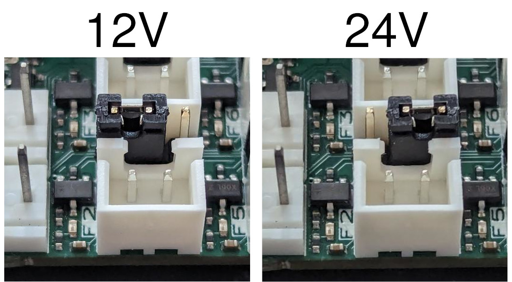
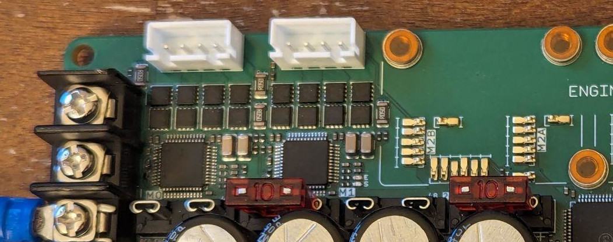

# Corevus-G v0.6 user's manual

This user manual provides information on Corevus-G board revision v0.6 and contains information on hardware features and setting up Klipper. Also consult the [Klipper documentation](https://www.klipper3d.org/Config_Reference.html)

## General disclaimer and usage notes

Although v0.6 is much improved over prior Corevus-G prototype revisions, please be aware that this is still not production hardware as I am still gathering data and tracking issues related to long-term reliability. Use at your own risk! That said, if you do experience hardware issues please do inform me and I will try to help track the issue and/or provide replacement hardware if necessary (no guarantees on this though).

Now that we've gotten that out of the way, promise to be careful and not set anything on fire. Thanks

## Hardware overview

- Two integrated >3.0A(rms) TMC2160 drivers with low Rds MOSFETs
- Four integrated 1.2A(rms) TMC2209 drivers.
- Screw-on motor drivers have significantly better current and thermal handling than stepsticks
- 48V on motor drivers supported 
- 4 heaters + DC heatbed output (can drive SSRs or other loads)
- On-board thermistors in key locations (motor drivers, 12V, 5V converters)
- 8 temperature sensor ports (in addition to board thermistors)
- Pretty decent analog — 0.1 °C noise on 100k/3950 thermistors typical
- Twelve fan ports, including two 12-volt 4-pin fan ports, six 12/24V jumperable 2-pin fan ports, and four fixed-voltage fan ports
- Four endstop ports, one of which can be configured for 24 volts for inductive probe
- Toolboard breakout allows wiring up a Corevus Toolboard without need for a dedicated breakout board in your electronics bay
  

## Installing Klipper firmware

Flashing can be done over USB-DFU from your Raspberry Pi or other Klipper host computer. Alternatively, you can also build and flash the Klipper firmware on another device such as a desktop computer with Klipper downloaded, which may speed up compilation.

> [!WARNING]
> Installing firmware should be done with Corevus-G disconnected from everything except the flashing device.

Flashing firmware is best done prior to installing Corevus-G in your printer. If you are upgrading firmware on Corevus-G installed in an existing machine, consider taking a picture of the wiring scheme before disconnecting any connected hardware to prevent mistakes when re-wiring.

Connect Corevus-G to your flashing device (e.g. Raspberry Pi) via a USB cable into the 'MCU USB' port. (Don't connect into the 'TOOLHEAD USB' port, that goes to the toolhead connector). Corevus-G should be receiving power over the USB cable.

To enter DFU mode on the microcontroller, hold down the button labeled 'DFU', press and release the button labeled 'RST'. Once the 'RST' button is released, the STM32 microcontroller should boot into a state that allows flashing firmware over DFU. Ensure that Corevus-G is connected and in DFU mode by running `lsusb` and looking for '0483:df11 STMicroelectronics STM device in DFU mode'. 

To build and flash Klipper,
- On your Raspberry Pi (or other device with Klipper installed), `cd ~/klipper` and then run `make menuconfig`, which should bring up the build menu. The relevant parameters to be selected here are: 
	```
	[*] Enable extra low-level configuration options
    Micro-controller Architecture (STMicroelectronics STM32)  --->
    Processor model (STM32H723)  --->
    Bootloader offset (No bootloader)  --->
    Clock Reference (25 MHz crystal)  --->
    Communication interface (USB (on PA11/PA12))  --->
	```  
- Run `make clean` and then `make` (or `make -j4` on newer Raspberry Pis) to compile the Klipper firmware
- Run `make flash FLASH_DEVICE=0483:df11` to flash the compiled firmware to the attached microcontroller in DFU mode (this may report an 'Error 255', ignore that)
- To verify that Klipper has been flashed successfully, run `lsusb` again and look for '1d50:614e OpenMoko, Inc. stm32h723xx'
- Run `ls /dev/serial/by-id/*` and copy the resulting serial symlink into your Klipper config file. If you are using Fluidd, you can also find this in the 'Devices' menu in the config text editor.
  - Remember to copy the entire directory path, e.g. '/dev/serial/by-id/usb-Klipper_stm32h723xx_2C000E000751323237393937-if00' instead of just 'usb-Klipper_stm32h723xx_2C000E000751323237393937-if00'.

Don't install Corevus-G in your machine yet until you have finished writing your config file.

## Configuration 

Every hardware setup is unique and I cannot possibly cover all use cases. That said however, this guide should provide useful information on creating your own configuration file or modifying an existing config.

### Pin aliases

This pin aliases section translates microcontroller pin names (e.g. PC5, PC6) to human readable equivalents corresponding to Corevus-G peripherals (e.g. M1_STEP, M5_EN, T0, HB). One need not consult a pinout diagram while writing the config file.


```
[board_pins Corevus-G-v0.6] # MUST MATCH YOUR COREVUS HARDWARE
mcu: # specify name given to microcontroller, typically 'mcu'
aliases:
# TMC2160 drivers
	M0_STEP = PG8,  M0_DIR = PG7, M0_EN = PG5,  M0_CS = PG6, M0_STALL = PG4,
	M1_STEP = PD15, M1_DIR = PG2, M1_EN = PD14, M1_CS = PG3, M1_STALL = PD13,
# Driver expansion ports
	M2A_STEP = PB12, M2A_DIR = PE12, M2A_EN = PE13, M2A_CS = PE14, M2A_STALL = PE15, M2A_UART = PE14,
	M2B_STEP = PD12, M2B_DIR = PD11, M2B_EN = PD10, M2B_CS = PD9,  M2B_STALL = PD8, M2B_UART = PD9,
	M3A_STEP = PF13, M3A_DIR = PF14, M3A_EN = PF15, M3A_CS = PG1,  M3A_STALL = PG0, M3A_UART = PG1,
	M3B_STEP = PE11, M3B_DIR = PE10, M3B_EN = PE9,  M3B_CS = PE8,  M3B_STALL = PE7, M3B_UART = PE8,
# TMC2209 drivers
	M4_STEP = PF11, M4_DIR = PC4,  M4_EN = PC5,  M4_UART = PF12,
	M5_STEP = PF3,  M5_DIR = PF1,  M5_EN = PF2,  M5_UART = PF4,
	M6_STEP = PC15, M6_DIR = PC13, M6_EN = PC14, M6_UART = PF0,
	M7_STEP = PE4,  M7_DIR = PE2,  M7_EN = PE3,  M7_UART = PE5,
# Heaters
	HB = PC6, H0 = PC7, H1 = PC8, H2 = PC9, H3 = PA8,
# Fans
	F0 = PB4, F1 = PB3, F0_FG = PC11, F1_FG = PC10,
	F2 = PB5, F3 = PG12, F4 = PA10, 
    F5 = PB6, F6 = PG13, F7 = PA15, 
    F8 = PB9, F9 = PB8, F10 = PE6, F11 = PB7,
# Thermistors
	T0 = PF10, T1 = PA1, T2 = PC2, T3 = PC3,
	T4 = PC0, T5 = PC1, T6 = PF5, T7 = PF6,
	M1_THERM = PB1, M2_THERM = PB0, M3_THERM = PF9,
	M4_THERM = PA4, 5V_THERM = PF7, 12V_THERM = PF8,
# Endstops
	S0 = PG10, S1 = PG15, S2 = PE0, S3 = PE1
```
### On-board thermistors

On-board thermistors are installed on the M1 (TMC2160) and M4 (TMC2209) motor drivers as well as the 12V / 5V DC-DC converters to monitor thermal loads and detect overheating. Displaying board thermals as shrimple™ as creating a `[temperature_sensor]` in Klipper and displaying the temperatures in the chart next to your heater temperatures. 

```
################################
## Corevus-G v0.6 thermistors ##
################################

[thermistor CvBoardTherm]
temperature1: 25.0
resistance1: 10000.0
beta: 3950

[temperature_sensor M1_Driver] # TMC2160
sensor_type: CvBoardTherm
sensor_pin: M1_THERM
min_temp: -20
max_temp: 85

[temperature_sensor M4_Driver] # TMC2209
sensor_type: CvBoardTherm
sensor_pin: M4_THERM
min_temp: -20
max_temp: 85

[temperature_sensor 12V]
sensor_type: CvBoardTherm
sensor_pin: 12V_THERM
min_temp: -20
max_temp: 85

[temperature_sensor 5V]
sensor_type: CvBoardTherm
sensor_pin: 5V_THERM
min_temp: -20
max_temp: 85
```

The maximum temperature of 85 °C is a good compromise between safety and performance. If you need additional performance, especially in the smaller TMC2209s, it should be possible to increase the maximum temperature to 100 °C although this is not recommended.

Screw-mounted motor drivers also come with on-board thermistors. If you have drivers installed in M2 and/or M3, add the following sections to your config: 

```
# Uncomment if using expansion ports M2 or M3

#[temperature_sensor M2_Driver]
#sensor_type: CvBoardTherm
#sensor_pin: M2_THERM
#min_temp: -20
#max_temp: 85

#[temperature_sensor M3_Driver]
#sensor_type: CvBoardTherm
#sensor_pin: M3_THERM
#min_temp: -20
#max_temp: 85
```

### Motors [WIP]

When configuring motor drivers, the important values to get right here are 'run_current', 'hold_current' and 'sense_resistor'. For now, set 'run_current' to a **very low value** — such as 10-20% of the rated motor current — and 'hold_current' to be the same as 'run_current' (we will change this later). The correct value for 'sense_resistor' can be found by checking the physical sense resistors on the board next to the driver MOSFETs. A resistor code 'R050' indicates 0.050 Ω, 'R100' indicates 0.100 Ω, etc. TMC2160 drivers on Corevus-G v0.6 and forward use 0.05 Ω sense resistors. TMC2160 drivers on older Corevus revisions use 0.03 Ω. TMC2209 drivers typically use 0.1 Ω. Make sure to get this right.
> [!WARNING]
> <u>**You must**</u> check the sense resistor value against your hardware! Misconfiguration of these values may cause an electrical fire or destruction of hardware. Again, for safety specify an intentionally low 'run_current' value while setting up to avoid the worst of consequences.
>
> Don't be that guy who let the magic smoke out of his steppers. (It has happened before!)

The two integrated TMC2160 drivers are designated M0 and M1, and are connected to SPI bus 'spi2' in Klipper. This following config section configures them as the XY motors in a Cartesian / CoreXY machine. (The `[tmc5160]` module is used as the two devices are for the most part register compatible.) Again, customize this section to your specific machine, including limit positions and endstop pins.
```
[stepper_x] # M0 Driver
enable_pin: !M0_EN
step_pin: M0_STEP
dir_pin: M0_DIR
microsteps: 256
full_steps_per_rotation: 
rotation_distance: 
endstop_pin: 
position_endstop: 
position_max: 
homing_speed: 
homing_retract_dist: 

[tmc5160 stepper_x]
spi_bus: spi2
cs_pin: M0_CS
diag1_pin: ^!M0_STALL # used for sensorless homing
sense_resistor: 0.05 # CHECK THIS AGAINST YOUR HARDWARE!!!
run_current: 0.50
hold_current: 0.50
interpolate: True

[stepper_y] # M1 Driver
enable_pin: !M1_EN
step_pin: M1_STEP
dir_pin: M1_DIR
microsteps: 256
full_steps_per_rotation: 
rotation_distance: 
endstop_pin: 
position_endstop: 
position_max: 
homing_speed: 
homing_retract_dist: 

[tmc5160 stepper_y]
spi_bus: spi2
cs_pin: M1_CS
diag1_pin: ^!M1_STALL # used for sensorless homing
sense_resistor: 0.05 # CHECK THIS AGAINST YOUR HARDWARE!!!
run_current: 0.50
hold_current: 0.50
interpolate: True
```

Each of the screw-mounted driver expansion slots (M2, M3) has two sets of driver signals (M2A, M2B; M3A, M3B) for forward compatibility with future dual-driver modules. When using single-driver modules, configure with the 'A' pin names. 

This is an example config for two additional TMC2160 drivers installed in the M2 and M3 driver slots and configured as X1 and Y1 in a 4-motor XY system. (Remember to enable M2 and/or M3 temperature sensors if drivers are installed, and to leave them commented out if they aren't.) Adapt to your usAgain, **check sense resistances against your hardware**.
```
[stepper_x1] # M2 Driver
enable_pin: !M2A_EN
step_pin: M2A_STEP
dir_pin: M2A_DIR
full_steps_per_rotation: 
rotation_distance: 
microsteps: 256

[tmc5160 stepper_x1]
spi_bus: spi2
cs_pin: M2A_CS
interpolate: True
run_current: 0.5
hold_current: 0.5
sense_resistor: 0.05 # CHECK THIS AGAINST YOUR HARDWARE!!!

[stepper_y1] # M3 Driver
enable_pin: !M3A_EN
step_pin: M3A_STEP
dir_pin: M3A_DIR
full_steps_per_rotation: 
rotation_distance: 
microsteps: 256

[tmc5160 stepper_y1]
spi_bus: spi2
cs_pin: M3A_CS
interpolate: True
run_current: 0.5
hold_current: 0.5
sense_resistor: 0.05 # CHECK THIS AGAINST YOUR HARDWARE!!!
```
Again, customize the pin name assignments here to your specific machine, e.g. rearranging motor to driver assignments for better wiring layout (especially in 4-motor CoreXY or cross-gantry wiring schemes), 3 TMC2160s for delta, etc. 

Finally, here's an example config for using three of the integrated TMC2209 drivers (M4, M5, M6) to control a 3-point Z system. In my experience, enabling StealthChop works far better than SpreadCycle at not producing irritated high-pitched commutation whine on Z-axis and other statically loaded motors, however it is probably wise to test both and use whichever one works better. 

``` 
[stepper_z]
step_pin: M4_STEP
dir_pin: M4_DIR
enable_pin: !M4_EN
full_steps_per_rotation: 200
rotation_distance: 
gear_ratio: 
microsteps: 64
endstop_pin: 
position_min: 
position_max: 
homing_speed: 
homing_retract_dist: 
second_homing_speed: 
homing_positive_dir: 

[tmc2209 stepper_z] # M4 Driver
uart_pin: M4_UART
interpolate: True
stealthchop_threshold: 999999
run_current: 0.2
hold_current: 0.2
sense_resistor: 0.1

[stepper_z1] # M5 Driver
step_pin: M5_STEP
dir_pin: M5_DIR
enable_pin: !M5_EN
full_steps_per_rotation: 200
rotation_distance: 
gear_ratio: 
microsteps: 64

[tmc2209 stepper_z1]
uart_pin: M5_UART
interpolate: True
stealthchop_threshold: 999999
run_current: 0.2
hold_current: 0.2
sense_resistor: 0.1

[stepper_z2] # M6 Driver
step_pin: M6_STEP
dir_pin: M6_DIR
enable_pin: !M6_EN
full_steps_per_rotation: 200
rotation_distance: 
gear_ratio: 
microsteps: 64

[tmc2209 stepper_z2]
uart_pin: M6_UART
interpolate: True
stealthchop_threshold: 999999
run_current: 0.2
hold_current: 0.2
sense_resistor: 0.1
```
Again, customize this and above sections to your specific machine and application (for example, using more or fewer motors on Z), etc.


### Heaters, fans, etc [WIP]

This is a config for an extruder wired up to heater H0, temperature sensor T0, stepper driver M7, and hotend fan F2. Customize the following to your specific application by changing specified values or pin names.

> [!WARNING]
> Only use heater pins (e.g. H0, H1, H2, H3, HB) for driving heaters! On Corevus-G v0.6, these do not turn on while the STM32 is in boot mode. The same is not the case for other pins, such as F4. Connecting heaters to non-heater ports may result in catastrophic results.

```
[extruder]
step_pin: M7_STEP
dir_pin: !M7_DIR
enable_pin: !M7_EN
microsteps: 64
rotation_distance: # [mm]
gear_ratio: # [xx:yy]
nozzle_diameter: 0.4 # [mm]
filament_diameter: 1.75
pressure_advance: # [s]
pressure_advance_smooth_time: # [s]
pwm_cycle_time: 0.01
control: pid
pid_kp: 10 # needs tuning
pid_ki: 1 # needs tuning
pid_kd: 20 # needs tuning
heater_pin: H0 # or other heater pin
sensor_type: # name of sensor
sensor_pin: T0 # or other thermistor pin
min_temp: 0
max_temp: 60 # change once set up
max_power: 1
min_extrude_temp: 180 # change once set up

[tmc2209 extruder]
uart_pin: M7_UART
interpolate: True
run_current: 0.2
hold_current: 0.2
sense_resistor: 0.1

[heater_fan hotend_fan]
pin: F2
fan_speed: 1.0
max_power: 1.0
kick_start_time: 0.5
heater: extruder
heater_temp: 50
```

## Post-config 

- Bring a fire extinguisher
- Power up your machine and pray it doesn't catch fire 
  - If machine catches on fire, extinguish fire
- Congratulations, your machine is not on fire. Continue with setup: 

Verify that temperature sensors such as your hotend and heatbed thermistors are reporting room temperature, and not an implausibly high or low value that may result from an egregious configuration error. Once this is done, go back and raise 'max_temp' values to their nominal operating temperature limits.

Verify that machine kinematics are functioning, that your motors are not overheating when powered on, and that homing works normally (this procedure may be slightly more involved with sensorless homing). Once this is done, go back and in your motor TMC driver config sections, raise 'run_current' and 'hold_current' values to their nominal operating values. 

Larger current means more torque (and thus a quicker printer) but also increased waste heat. The desired value depends on the rated current of the motor, which is specified by the manufacturer, and other factors — for example, a motor mounted to an aluminium plate will be able to safely operate at a higher current than a motor mounted to plastic owing to the higher temperature resistance of aluminium and its ability to conduct heat.

## Usage

### Fan voltages

Fan ports F0 and F1 (4-pin) are 12V only, and support PWM and tachometer I/O to e.g. a 4 pin PC fan.

Fan ports F2-F7 (2-pin) are 12/24V selectable by moving the position of the adjacent jumper between the 12V and 24V positions, as shown:


Fan ports F8-F9 (2-pin) are 12V only. Fan ports F10-F11 (2-pin) are 5V only.

### Motor voltage selection

The board supplies an external power entry labeled "48V MOTOR", where a dedicated e.g. 48V power supply can be used to power M0-M3. The TMC2160 drivers are rated to 48V and higher drive voltage may increase motor torque at faster motor velocities and can be useful for certain high-speed applications. 


To set a certain driver bank to 48V, (e.g. the M0 and M1 TMC2160 drivers) move the associated fuse (e.g. M0-1) from the 24V position to the 48V position, and then connect the board to the 48V power supply. The fuses may be difficult to remove, so be gentle. 

Note that you should ensure your machine and motors work normally running off the main 24V supply before setting up 48V operation.

> [!WARNING]
> Before setting the M2-3 voltage to 48V make sure that all hardware attached to the driver ports is actually rated for the specified voltage. Feeding 48V into a device not rated for may have catastrophic results.

> [!NOTE]
> Higher voltages on the motor drivers will creater more heat from greater switching losses in the transistors. Keep an eye on your motor driver temperatures and ensure that your drivers are not getting unacceptably hot.

> [!NOTE]
> If you are using sensorless homing via StallGuard on your motor drivers, they may need recalibration.


Let me know of your thoughts on this documentation in the discord server and/or possible changes. Enjoy testing Corevus and thanks for your support.

— meridi
