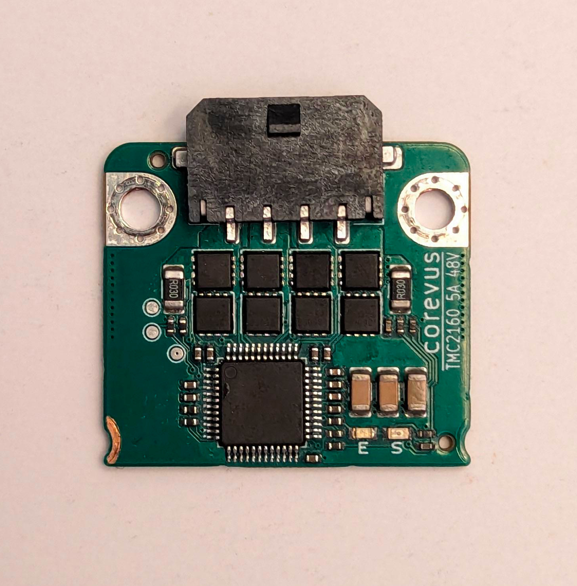
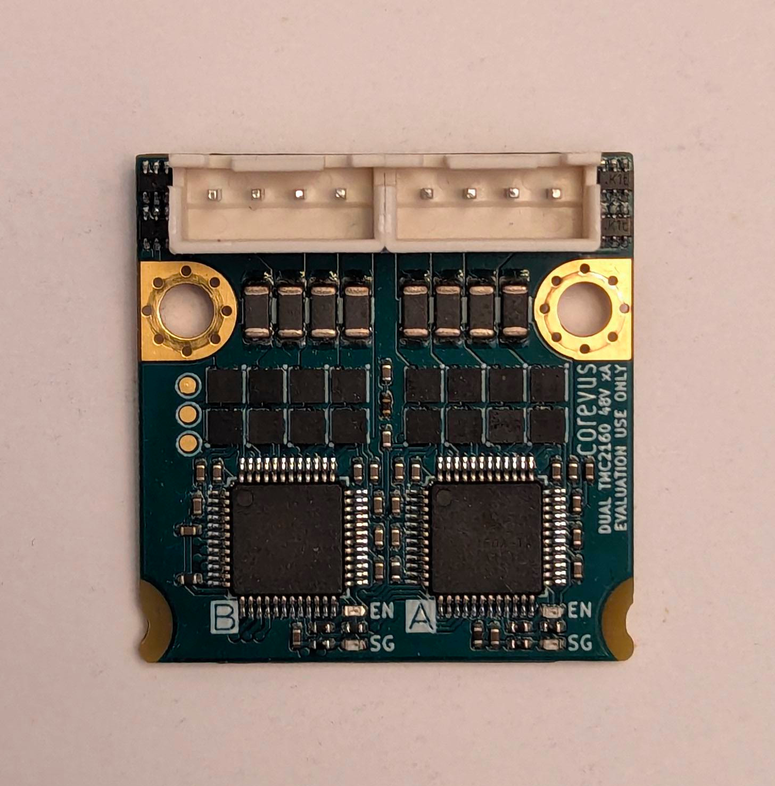
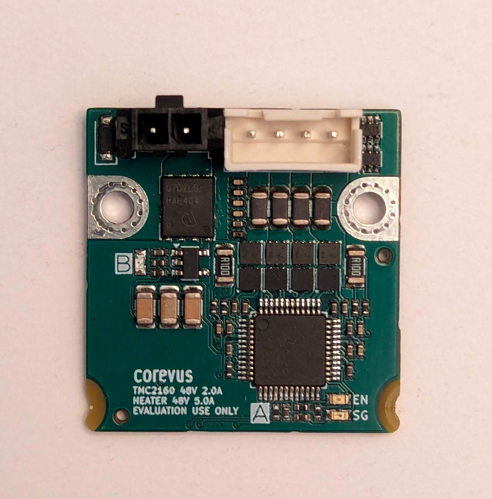

# Corevus driver modules documentation

Work in progress.

## Onboard thermistor

All modules have an onboard 10kΩ 3950K thermistor + 4.7kΩ pullup resistor voltage divider (common across all Corevus hardware) for temperature measurement, which can be read out over a dedicated THERM pin.

```
[thermistor CorevusBoardTherm] # this only needs to appear once in your config
temperature1: 25.0
resistance1: 10000.0
beta: 3950

[temperature_sensor Mx_Driver] # your driver module name here
sensor_type: CorevusBoardTherm
pullup_resistor: 4700
sensor_pin: Mx_THERM
min_temp: 0
max_temp: 60
```

**It is strongly recommended to configure this for every on-board thermistor** in your setup, to detect and mitigate potentially dangerous overheating caused by configuration errors or hardware failures.

When removing modules, one should remember to delete the relevant thermistor configuration. 

## StallGuard sensorless homing usage

Trinamic motor drivers support sensorless homing via StallGuard, routed over a dedicated STALL pin on the module.

For sensorless homing users, DangerKlipper is recommended See details on [here](https://dangerklipper.io/Danger_Features.html#sensorless-homing)

## Driver modules

Available:
- TMC2209
- TMC2160 
- TMC2160 5A
- Dual TMC2160
- Heater + TMC2160 (for 48V extruders)
  
Notionally planned (but not available yet):
- Dual TMC2209
- MAX31865 RTD ADC
- I/O pin breakout

### TMC2209

### TMC2160

> [!NOTE]
> Older versions of the TMC2160 module uses 0.030 Ω sense resistors — remember to check your driver module and configure this correctly in your `sense_resistor` field

### TMC2160 5A

Similar to above, but with upgraded, lower resistance MOSFETs and a higher-current Micro-Fit 3.0 connector.

**Configuration guide:**
```

```

> [!NOTE]
> This module uses 0.030 Ω sense resistors — remember to configure this correctly in your `sense_resistor` field

### Dual TMC2160


Uses both sets of driver signals. 


**Relevant configuration parameters:**
```
[stepper_<n>]
step_pin: MxA_STEP
dir_pin: MxA_DIR
enable_pin: !MxA_EN
rotation_distance: 40
microsteps: 64
full_steps_per_rotation: 200
position_min: 
position_endstop: 
position_max: 
endstop_pin: # use 'tmc5160_stepper_<n>:virtual_endstop' for sensorless 


[tmc5160 stepper_<n>]
cs_pin: MxA_CS
spi_bus: spi2
sense_resistor: 0.05
run_current: 0.3
## Use below settings for sensorless homing
# diag1_pin: ^!MxA_STALL
# driver_SGT:

[stepper_<n>]
step_pin: MxB_STEP
dir_pin: MxB_DIR
enable_pin: !MxB_EN
rotation_distance: 40
microsteps: 64
full_steps_per_rotation: 200
position_min: 
position_endstop: 
position_max: 
endstop_pin: # use 'tmc5160_stepper_<n>:virtual_endstop' for sensorless 


[tmc5160 stepper_<n>]
cs_pin: MxB_CS
spi_bus: spi2
sense_resistor: 0.05
run_current: 0.3
## Use below settings for sensorless homing
# diag1_pin: ^!MxB_STALL
# driver_SGT:
```


### Heater + TMC2160

This driver module combines a TMC2160 and a heater driver MOSFET, both of which are rated for 48V operation. Intended for users running 48V to toolhead heaters and extruder motors. 

**Relevant configuration parameters:**
```
[extruder]
step_pin: MxA_STEP
dir_pin: !MxA_DIR
enable_pin: !MxA_EN

heater_pin: MxB_STEP
sensor_pin: 

min_temp: 0
max_temp: 50 #temporary
max_power: 1
min_extrude_temp: 0 #temporary

[tmc5160 extruder]
cs_pin: MxA_CS
spi_bus: spi2 
sense_resistor: 0.10
run_current: 0.15 #temporary
```
Again, once you have verified that both heater and extruder motor behave nominally without issues, raise `max_temp` and `run_current` to the desired values.

> [!NOTE]
> This module uses 0.100 Ω sense resistors — remember to configure this correctly in your `sense_resistor` field
