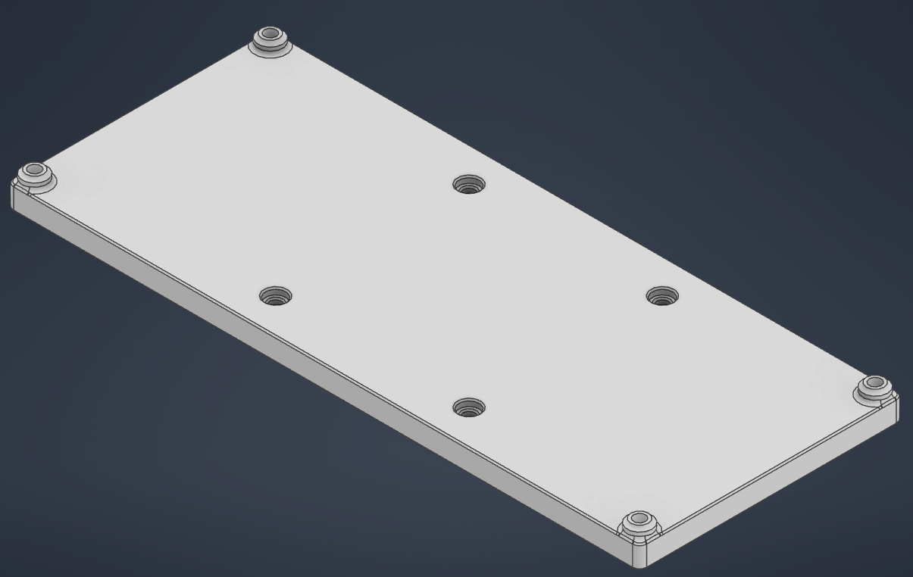
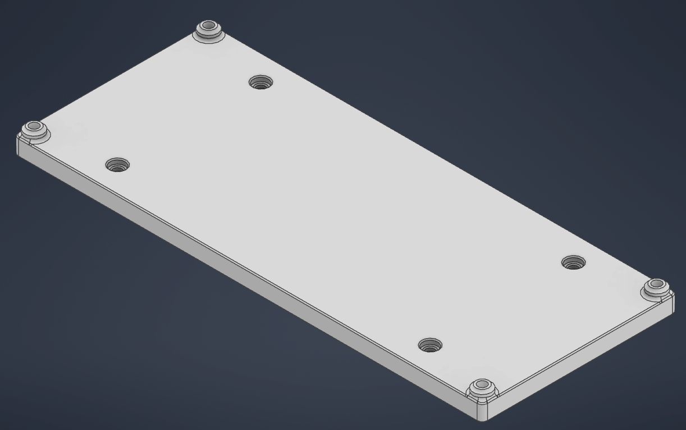
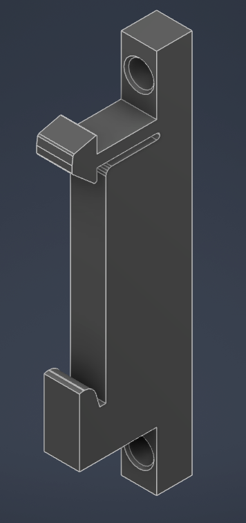
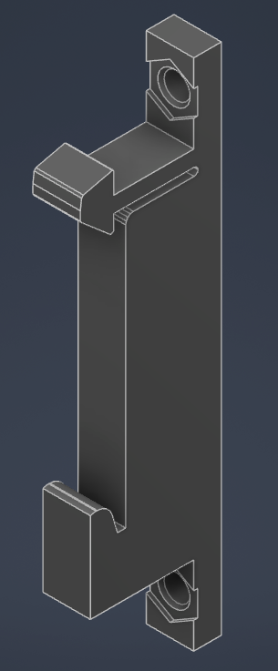
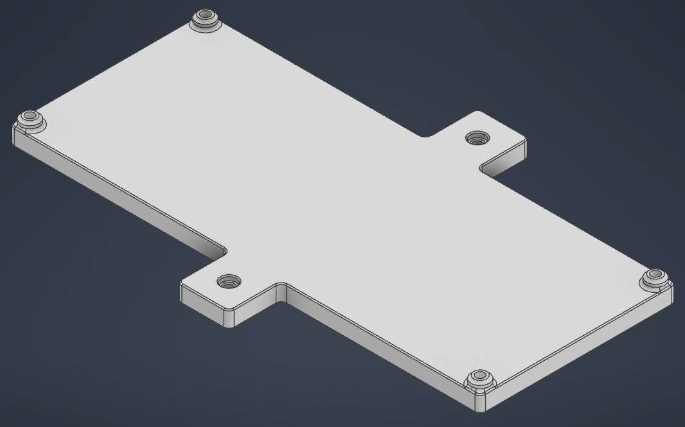
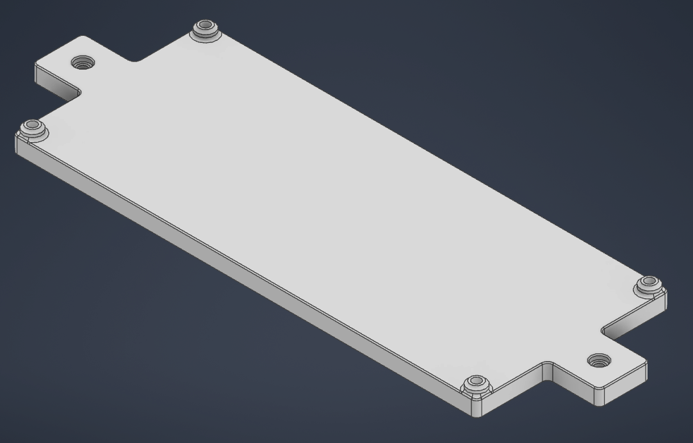
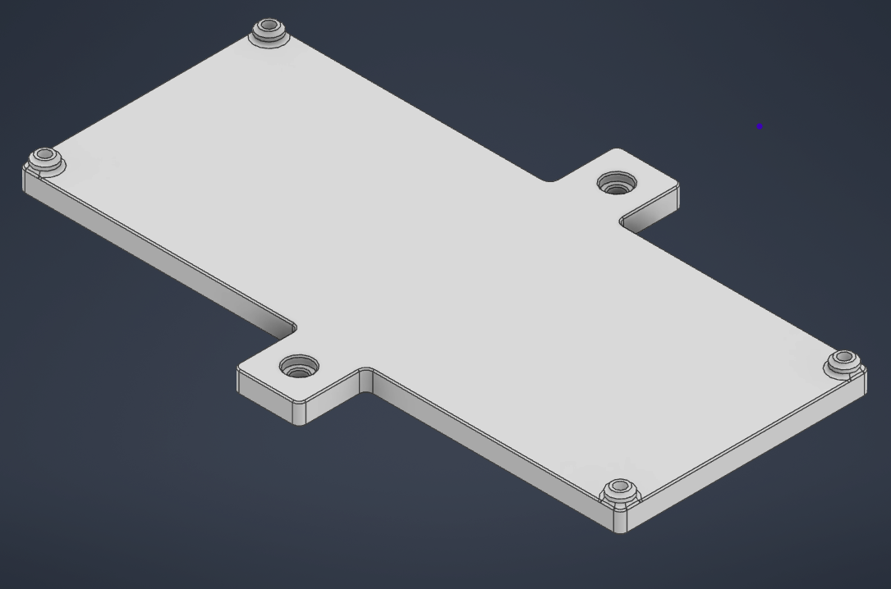
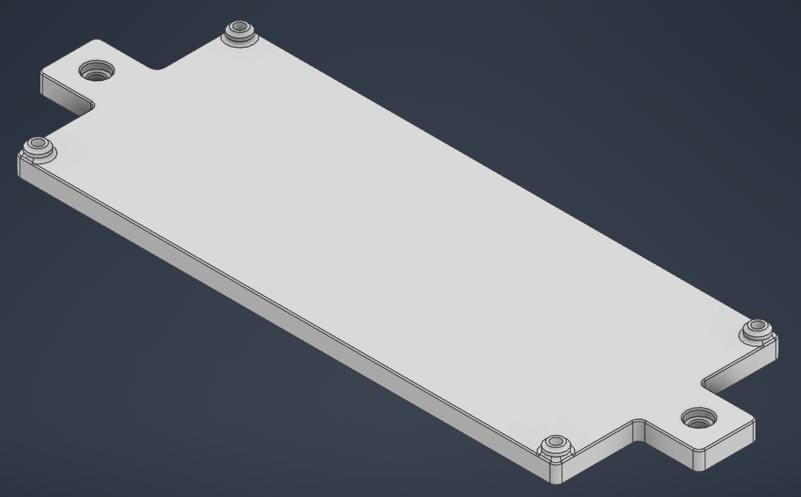
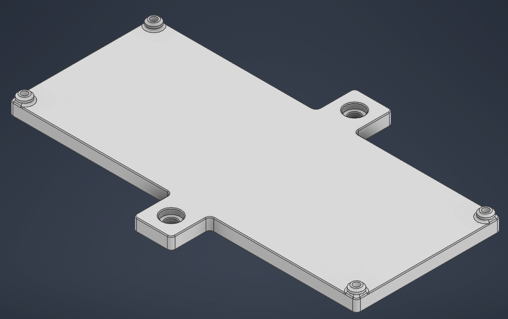
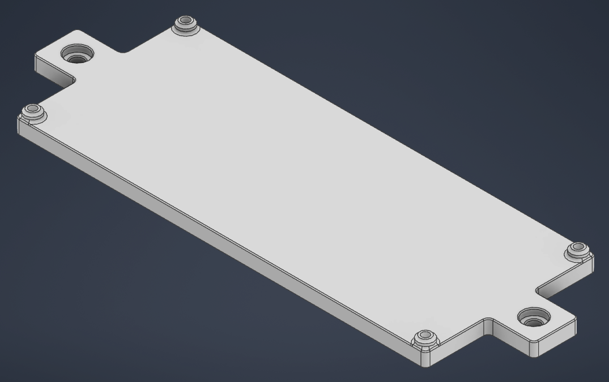

# Options and BOM

Base material required for every version of the mounts
| Qty | Item              |
| --- | ----------------- |
| 4   | M3 Heatset Insert |
| 4   | M3 x 8 or 10 BHCS |

## Din Rail Mount
Board mount that uses printed din rail clamps to attach the board to the printer.

* [Din_Vertical](<./STL/Corevus_Mount_Din_Rail_Vertical.stl)

* [Din_Horizontal](<./STL/Corevus_Mount_Din_Rail_Horizontal.stl)

### Din Rail Clamps
#### Heatset Rail Clamps
Uses heatset inserts with bolts to fasten the clamp to the board mount.
Required materials
| Qty | Item              |
| --- | ----------------- |
| 4   | M3 Heatset Insert |
| 4   | M3 x 10 BHCS      |

* [Din_Heatset](<./STL/Din_Mount_Heat_Inserts.stl)

#### Hex Rail Clamps
Uses hex nuts with bolts to fasten the clamp to the board mount.

Required materials
| Qty | Item              |
| --- | ----------------- |
| 4   | M3 Hex Nut        |
| 4   | M3 x 10 BHCS      |

* [Din_Hex](<./STL/Din_Mount_Hex.stl)

## Extrusion Mounts

### M3 Extrusion Mounted
Board mount that uses M3 bolts and T nuts to fix the mount to an extrusion, a version vertically and horizontally mounted is availible.

Required materials
| Qty | Item              |
| --- | ----------------- |
| 2   | M3 T Nut          |
| 4   | M3 x 8 or 10 BHCS |

* [M3_Extrusion_Vertical](<./STL/Corevus_Mount_Extrusion_Vertical_M3.stl)

* [M3_Extrusion_Horizontal](<./STL/Corevus_Mount_Extrusion_Horizontal_M3.stl)

### M4 Extrusion Mounted
Board mount that uses M4 bolts and T nuts to fix the mount to an extrusion, a version vertically and horizontally mounted is availible.

Required materials
| Qty | Item              |
| --- | ----------------- |
| 2   | M4 T Nut          |
| 4   | M4 x 8 BHCS       |

* [M4_Extrusion_Vertical](<./STL/Corevus_Mount_Extrusion_Vertical_M4.stl)

* [M4_Extrusion_Horizontal](<./STL/Corevus_Mount_Extrusion_Horizontal_M4.stl)

### M5 Extrusion Mounted
Board mount that uses M5 bolts and T nuts to fix the mount to an extrusion, a version vertically and horizontally mounted is availible.

Required materials
| Qty | Item              |
| --- | ----------------- |
| 2   | M5 T Nut          |
| 4   | M5 x 8 BHCS       |

* [M5_Extrusion_Vertical](<./STL/Corevus_Mount_Extrusion_Vertical_M5.stl)

* [M5_Extrusion_Vertical](<./STL/Corevus_Mount_Extrusion_Vertical_M5.stl)

